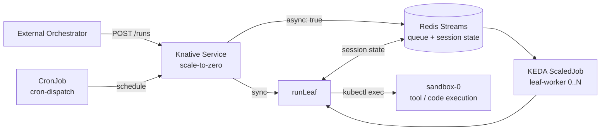

# Serverless Harness

**Run stateful AI coding agents serverless — scale to zero between turns, resume exactly where they left off.**

-success)


Serverless Harness turns a long-lived AI agent into a **scale-to-zero workload** on Kubernetes.
An agent process normally has to stay resident — holding its conversation, tool state, and working
directory in memory — even while it sits idle waiting for the next turn or for a human to approve a
step. That idle time is pure cost. The harness decouples the agent's **state** (durable in Redis)
and its **tool execution** (an isolated sandbox pod) from the **agent process** itself, so the agent
runs as a Knative service that drops to zero pods when idle and cold-starts with full session
continuity on the next request.

The result is a **leaf-session backend**: an external orchestrator dispatches isolated units of agent
work ("leaves") over a simple HTTP + shared-volume contract, and the harness runs each one
sync, async (queued), scheduled, or paused-for-approval — all on infrastructure that costs nothing at
rest.

## Table of Contents

- [Why](#why)
- [Architecture](#architecture)
- [Features](#features)
- [Quick Start](#quick-start)
- [How It Works](#how-it-works)
- [Dispatch Archetypes](#dispatch-archetypes)
- [Repository Layout](#repository-layout)
- [Evidence](#evidence)
- [Roadmap](#roadmap)
- [Documentation](#documentation)
- [Status & License](#status--license)

---

## Why

| Persistent agent | Serverless Harness |
|------------------|--------------------|
| Process stays resident between turns | Scales to **zero** when idle, cold-starts in sub-second |
| State lives in process memory — lost on crash/evict | State lives in **Redis** — survives eviction, restart, and cold start |
| Tools execute in the agent process | Tools execute in an **isolated sandbox pod** (brain/hands split) |
| Idle compute billed continuously | **Only Redis + sandbox** stay resident (2 pods at rest) |
| One invocation model | **Four**: sync, async fan-out, scheduled, human-gated |

In an idle-heavy workload [experiment](deploy/knative/EXPERIMENTS.md), the serverless path consumed
roughly **a quarter** of the pod-seconds of an equivalent always-on agent — because the expensive
part (the agent process) exists only while a turn is actively running.

---

## Architecture



| Component | Role |
|-----------|------|
| **Knative Service** | Scale-to-zero HTTP endpoint; runs a turn inline (sync) or enqueues it (async) |
| **Redis** | Durable session state (resume by `sessionId`), work queue (Streams), gate state |
| **KEDA ScaledJob** | Autoscales `leaf-worker` pods 0→N on queue depth (`lagCount` + `pendingEntriesCount`) |
| **sandbox-0** | Persistent pod where all tool/code execution runs; reached via `kubectl exec` |
| **Shared PVC** | Volume-envelope contract — inputs, results, and markers travel as files |
| **CronJob** | Scheduled dispatch (`cron-dispatch`) for periodic batch work |

> **Note:** The Knative Service and the `leaf-worker` are the **same container image** with two entry
> points (`server.ts` vs `leaf-job.ts`). Both converge on `runLeaf()`, which routes execution into
> `sandbox-0`. The "brain" (model inference + session logic) runs in whichever pod called `runLeaf()`;
> the "hands" (actual command/tool execution) always run in the sandbox.

---

## Features

- **Scale-to-zero turns** — Knative drops the agent to zero pods between turns; the activator
  cold-starts a fresh pod on the next request.
- **Durable resume** — sessions are append-only logs in Redis; a cold-started pod recalls full
  conversation and state by `sessionId`, surviving pod eviction.
- **Brain/hands isolation** — the agent never executes tools in its own process; everything runs in a
  separate hardened `sandbox-0` pod via a persistent in-pod channel.
- **Four dispatch modes** — one `/runs` endpoint serves sync, async-queued, cron-scheduled, and
  human-gated execution (see [Dispatch Archetypes](#dispatch-archetypes)).
- **Human-in-the-loop gates** — a leaf can pause mid-run, report `awaiting_approval`, and resume on an
  external approve/reject/abort verdict — scaling to zero while it waits.
- **Volume-envelope contract** — orchestrators pass inputs and collect results as files on a shared
  PVC, decoupling result size from HTTP limits.
- **Hardened by default** — non-root UID, read-only root filesystem, all capabilities dropped,
  `RuntimeDefault` seccomp, no service-account token automount.
- **Built on Pi** — wraps a pinned [`kagenti/pi`](https://github.com/kagenti/pi) coding agent through
  an injectable `SessionStorageBackend` seam; the agent itself is unmodified.

---

## Quick Start

Bring up the full stack on a local [Kind](https://kind.sigs.k8s.io/) cluster and drive an agent that
scales to zero and resumes from cold.

> **Prerequisites:** `kind`, `kubectl`, `docker`, and an Anthropic-compatible model credential.

```bash
# 1. Clone (the Pi agent is a submodule)
git clone --recurse-submodules https://github.com/kagenti/serverless-harness.git
cd serverless-harness

# 2. Provide a model credential — either a direct key...
export ANTHROPIC_API_KEY=sk-...
#    ...or a Bearer-token gateway (e.g. LiteLLM):
# export ANTHROPIC_BASE_URL=https://your-gateway
# export ANTHROPIC_AUTH_TOKEN=...

# 3. One-shot: create cluster, install Knative + Kourier, deploy Redis + sandbox + harness
./deploy/knative/setup-kind.sh
```

In a second terminal, expose the gateway and watch pods:

```bash
kubectl port-forward -n kourier-system svc/kourier 8080:80   # leave running
watch -n5 'kubectl get pods'                                  # in another pane
```

**Send the first turn** — a pod cold-starts to handle it, then scales back to zero:

```bash
curl -s -H "Host: serverless-harness.default.example.com" \
  -H "Content-Type: application/json" \
  -d '{"prompt":"Remember the secret word: pineapple. Reply only with OK."}' \
  http://localhost:8080/turn | jq .
# => { "sessionId": "019ed8e8-...", "response": "OK" }
```

**Resume across a cold start** — wait ~90s for the pod to terminate, then ask on the *same* session.
A fresh pod spins up from zero and still remembers the state from Redis:

```bash
export SID="<sessionId from above>"
curl -s -H "Host: serverless-harness.default.example.com" \
  -H "Content-Type: application/json" \
  -d "{\"sessionId\":\"$SID\",\"prompt\":\"What was the secret word?\"}" \
  http://localhost:8080/turn | jq .
# => response contains "pineapple"
```

See [`serverless-harness-demo.md`](serverless-harness-demo.md) for the full guided walkthrough
(including sandbox command execution) and [`deploy/knative/SMOKE.md`](deploy/knative/SMOKE.md) for the
verified smoke-test claims.

---

## How It Works

1. **An orchestrator POSTs a leaf** to `/runs` (or `/turn` for a single interactive turn).
2. The **Knative Service** wakes from zero, and either runs the leaf inline (`sync`) or pushes the
   envelope onto **Redis Streams** and returns `202` (`async: true`), then idles back to zero.
3. For async work, a **KEDA ScaledJob** scales `leaf-worker` pods up on queue depth and drains items.
4. Both paths call **`runLeaf()`**, which executes all tools inside **`sandbox-0`** via `kubectl exec`.
5. **Session state streams to Redis** as it goes, so the leaf is resumable by `sessionId` even if its
   pod dies mid-run.
6. **Results land as files** on a shared PVC, and a **done-marker** signals completion to the
   orchestrator.

---

## Dispatch Archetypes

The same backend serves three orchestration patterns, all validated end-to-end on Kind:

| Archetype | Pattern | Example use case |
|-----------|---------|------------------|
| **A — Async fan-out** | `{async:true}` → Redis Streams → KEDA scales workers 0→N → done-markers | "Research 10 topics concurrently" |
| **B — Human gate** | Leaf pauses → `awaiting_approval` → external verdict → resume/terminate | "Draft a clause, pause for legal sign-off, finalize" |
| **C — Scheduled** | CronJob → `cron-dispatch` reads a config list → posts each as async | "Summarize yesterday's tickets at 02:00 daily" |

---

## Repository Layout

```text
serverless-harness/
├── packages/
│   ├── session-backend/   # Generic append-only LogStore + Redis Streams impl
│   ├── k8s-sandbox/       # Routes Pi tool execution to a remote pod (kubectl exec)
│   ├── knative-server/    # HTTP server (server.ts) + leaf-worker (leaf-job.ts) entry points
│   └── work-queue/        # Redis Streams work queue (async dispatch)
├── harness/               # Pi SessionStorageBackend adapter (write-behind) + headless smoke
├── pi-fork/               # Pinned Pi coding agent (submodule) with the injectable backend seam
├── deploy/knative/        # Kind setup, manifests, smoke + experiment drivers
├── experiments/           # @sh/experiments — reproducible cost/behaviour experiments
└── docs/specs/            # Design specs (per-milestone) + milestone registry
```

---

## Evidence

Behaviour and economics are backed by reproducible experiments rather than claims:

- **[`deploy/knative/EXPERIMENTS.md`](deploy/knative/EXPERIMENTS.md)** — cluster experiments E1
  (economics), E3 (mobility), E4 (recovery), run live on Kind.
- **[`docs/experiment-results.md`](docs/experiment-results.md)** — E2 (reconstruction cost) and E5
  (budget enforcement) from the `@sh/experiments` workspace.
- **[`deploy/knative/SMOKE.md`](deploy/knative/SMOKE.md)** — the 6/6 cold-start + resume smoke claims.

---

## Roadmap

**Phase 1 — Decoupled Harness (built):** Redis session backend, remote sandbox client, persistent
in-pod channel, Knative wrapper, compaction-checkpoint fast path, experiments, and the leaf-session
backend with all three dispatch archetypes. See the
[milestone registry](docs/specs/README.md) for the source-of-truth status of every milestone.

**Phase 2 — Zero-Trust Credential Plane (design complete, deferred):** a credential plane where
*no component influenced by model output ever holds a raw secret.*

| ID | Adds |
|----|------|
| Z1 | Per-session SPIFFE identity (SPIRE) |
| Z2 | Secret-free, default-deny harness lock-down |
| Z3 | Inference injector — provider-key chokepoint, mTLS to the LLM gateway |
| Z4 | MCP code-mode in the sandbox |
| Z5 | Generalized credentialed egress (sandbox forward proxy) |
| Z6 | Subagents as isolated child sessions |
| Z7 | Red-team + formal validation of the credential plane |

Today the harness uses a trust-the-operator model: the model credential is a pre-provisioned
Kubernetes Secret, there is no egress policy, and all leaves share one service-account identity. Those
gaps are exactly what Phase 2 closes.

---

## Documentation

- [Executive overview — leaf-session backend](docs/executive-overview-leaf-session.md)
- [Milestone registry](docs/specs/README.md) — authoritative milestone numbering and status
- [Design specs](docs/specs/) — one dated design doc per milestone
- [`harness/README.md`](harness/README.md) — local dev build (Pi workspace build order, headless smoke)

---

## Status & License

This is explorative work. It is an MVP — the scale-to-zero, durable-resume, sandbox-isolation, 
and dispatch features above are built and smoke-verified; the zero-trust credential plane is 
designed but not yet implemented. Interfaces may change.

Licensed under the [Apache License 2.0](LICENSE).

