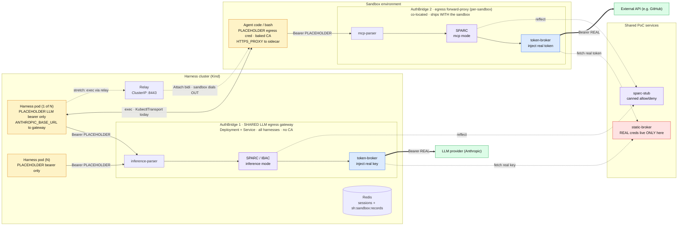

# RC1 — AuthBridge (Rosso Cortex) Egress Control-Plane PoC

- **Version:** 1.0
- **Status:** Proposed
- **Scope:** Single-tenant, Kind-first PoC. Real static-credential injection + real (stubbed-judge) control
  plugins on both harness HTTP egress hops; bring-your-own sandbox as a marked stretch.
- **Builds-on:** Z2 (harness lock-down, [`2026-06-26-harness-lockdown-design.md`](2026-06-26-harness-lockdown-design.md)),
  Z3 (inference injector, [`2026-06-26-inference-injector-design.md`](2026-06-26-inference-injector-design.md)),
  Z5 (generalized credentialed egress, [`2026-06-19-m13-generalized-credentialed-egress-design.md`](2026-06-19-m13-generalized-credentialed-egress-design.md)),
  Z4 (MCP code-mode, [`2026-06-18-m10-mcp-code-mode-design.md`](2026-06-18-m10-mcp-code-mode-design.md)),
  the SandboxTransport (`ST`, [`2026-07-08-sandbox-transport-grpc-design.md`](2026-07-08-sandbox-transport-grpc-design.md)).
- **Decision record:** [ADR-0025](../adrs/0025-authbridge-deployment-topology.md) (deployment topology).

---

## 1. Goal

Prove, end-to-end and single-tenant, that **Rosso Cortex / AuthBridge** can be the concrete mechanism for
the zero-trust credential plane on the serverless harness — doing both **credential injection** and
**action control** on the harness's HTTP egress hops, with the credential itself never held by any
model-influenced workload. The PoC is a **reference slice** (approach B): every seam is the shape it would
harden into, even though the credential is static and the control plugin's *judge* is canned.

This reframes the Phase-2 plane, written before AuthBridge was committed as the mechanism and before the
`#89` SandboxTransport inversion, around those two facts.

## 2. The four target capabilities

| # | Capability | PoC disposition | Fidelity |
|---|-----------|-----------------|----------|
| 1 | LLM credential injection (harness→LLM) | **Real** — harness holds a placeholder; AuthBridge `token-broker` swaps in the real provider key from `static-broker` | Production-shaped seam, static cred |
| 2 | Sandbox egress credential injection | **Real** — sandbox holds a placeholder; AuthBridge forward-proxy swaps in the real token for one external API | Production-shaped seam, static cred |
| 3 | SPARC/IBAC control (both hops) | **Real pipeline, stubbed judge** — real AuthBridge plugin on each hop; `sparc-stub` returns allow/deny by a simple rule | Seam real, verdict canned |
| 4 | Bring-your-own sandbox | **Stretch** — remote worker + its own egress AuthBridge dials the relay; the same leaf completes via `GrpcRelayTransport` | Gated on the transport live gate (ST5) |

**Non-goals (explicitly out of scope):** Keycloak, SPIRE/SPIFFE, RFC 8693 token-exchange, per-user
identity, multi-tenant, HA/multi-replica AuthBridge, a real SPARC reflection service.

**"Real credential injection" acceptance:** the workload pod provably never holds the secret (only a
placeholder in env), the real credential lives only in AuthBridge's mounted config (`static-broker`), and
the outbound request to the LLM/external API carries the real credential injected at the proxy.

## 3. Architecture

Two AuthBridge roles, one per hop, each running the standalone `authbridge-lite` proxy binary (no Envoy).
Their **deployment shapes differ by hop** — see [ADR-0025](../adrs/0025-authbridge-deployment-topology.md)
for the decision and trade-offs.

- **AuthBridge #1 — harness→LLM egress gateway. SHARED across all harnesses.** Own `Deployment` +
  `ClusterIP Service`; every harness pod routes to it via `ANTHROPIC_BASE_URL`. Reverse/egress proxy,
  single known destination, no baked CA. Plugin chain: `inference-parser` → `SPARC/IBAC (inference mode)`
  → `token-broker (inject)`. **Pre-dispatch** control gate. The harness holds only a placeholder bearer,
  and Z2's default-deny egress is tightened so the harness pod may reach *only* this gateway (enforceable
  "no key and can't phone home").
- **AuthBridge #2 — sandbox→external egress forward-proxy. CO-LOCATED with each sandbox.** Forward proxy
  with a baked CA (TLS-terminating), shipping with the sandbox bundle — a sidecar for in-cluster sandboxes,
  part of the remote bundle for BYO. Plugin chain: `mcp-parser` → `SPARC (mcp mode)` → `token-broker
  (inject)`. **Action-time** control + egress-injection gate. The sandbox's `HTTPS_PROXY` points here and
  its trust store carries the baked CA.
- **`static-broker` (new, tiny).** Minimal HTTP service implementing the `token-broker` contract
  (`POST /sessions/token`, keyed by `X-Server-Url` → returns the configured real token). No interactive
  login. Lets us use AuthBridge's **shipped** `token-broker` plugin unmodified while keeping the credential
  static/single-tenant. **The only place real credentials live.**
- **`sparc-stub` (new, tiny).** Canned reflector implementing the SPARC/IBAC reflection HTTP contract;
  returns allow/deny by a simple configured rule (tool-name denylist / arg marker). Real plugin, real
  pipeline, canned verdict.

Two invariants: (a) neither workload ever holds a real secret — both live only in `static-broker`; and
(b) on each hop the **control plugin runs before injection**, so a denied action never receives a real
credential.

### Diagram

*Solid thin* = placeholder-carrying request; *thick* (`==>`) = the real-credential egress leg injected at
AuthBridge; *dotted* = plugin side-calls and the `#4` stretch command path (sandbox dials out to the relay).

## 4. Flows

### Hop 1 — harness → LLM (capability #1 + gate #3a, pre-dispatch)

1. Harness sends an inference request to `ANTHROPIC_BASE_URL` (= AuthBridge #1) with
   `Authorization: Bearer <PLACEHOLDER>`.
2. `inference-parser` extracts model + proposed tool calls into request context.
3. `SPARC/IBAC (inference mode)` calls `sparc-stub` → allow/deny. **Deny** → block (`403`) *before*
   injection; the request never reaches the provider and never receives a real key. **Allow** → continue.
4. `token-broker` calls `static-broker` (`POST /sessions/token`, `X-Server-Url: <provider>`), gets the
   real key, and **replaces** the `Authorization` header.
5. AuthBridge egresses to the provider with `Authorization: Bearer <REAL>`.

### Hop 2 — sandbox → external API (capability #2 + gate #3b, action-time)

1. Agent code calls an external API through `HTTPS_PROXY` (= AuthBridge #2) with a placeholder bearer;
   the baked CA lets AuthBridge TLS-terminate and read L7.
2. `mcp-parser` extracts the MCP `tools/call` name + args.
3. `SPARC (mcp mode)` calls `sparc-stub` → allow/deny (blocks ungrounded/denylisted calls before egress).
4. `token-broker` fetches the real token from `static-broker` and swaps the header.
5. AuthBridge egresses to the external API with the real token.

### Stretch — BYO sandbox (capability #4)

The sandbox worker (bundled with its own AuthBridge #2 egress proxy) runs outside the harness cluster,
opens one outbound `Attach` bidi stream to the relay, and registers presence in Redis
(`sh:sandbox:records`). The harness dispatches the *same* leaf via `GrpcRelayTransport`; Hop-2 injection +
control run unchanged inside the remote bundle. Depends on the SandboxTransport live gate (ST5).

## 5. Demo scenarios (what we exec to prove each capability)

- **Cap #1 (LLM inject):** `kubectl exec <harness> -- printenv` shows only the placeholder (no real key);
  a leaf run completes (real key injected at AB1); AB1 audit log records the injection. Deny case: a
  configured denylisted tool call is blocked at AB1 with `403` *before* any key is fetched.
- **Cap #2 (sandbox inject):** the sandbox holds only a placeholder; a sandbox-run command hits an
  external echo/API target that reports back the `Authorization` it received = the **real** token; the
  sandbox never had it. Deny case: a denylisted MCP `tools/call` is blocked at AB2 before egress.
- **Cap #3 (control both hops):** for each hop, show an **allow** run and a **deny** run from the same
  `sparc-stub` rule set; assert the gate runs before injection (deny → no credential fetched).
- **Cap #4 (stretch, BYO):** the identical leaf that passed via `KubectlTransport` (in-cluster sandbox)
  also passes via `GrpcRelayTransport` against a remote worker carrying its own AB2 — same verdict/output.

## 6. Error handling & fail policies

- **`token-broker`** is **fail-closed**: no/invalid token on the request → `401`; if `static-broker` is
  unreachable the injection fails and **egress fails closed** — which is a *feature* here (it proves the
  workload cannot reach the target without the injector).
- **IBAC** is **fail-closed** (deny on judge error); **SPARC** is **fail-open** (a grounding *quality*
  gate, not an auth control) — the PoC keeps these native defaults and demonstrates the distinction.
- **Ordering:** control plugin before `token-broker` on both hops, so a denied action never receives a
  real credential.
- **Shared AB1 availability:** a gateway restart fails in-flight harness→LLM requests → normal leaf/turn
  retry; no key is cached in the harness, so nothing is exposed by the restart.
- **Baked CA (AB2):** the CA trust is distributed with the sandbox image/bundle; rotation is out of PoC
  scope (noted as follow-up).

## 7. Verdicts on existing Phase-2 specs

| Spec | Verdict | Rationale |
|------|---------|-----------|
| **Z1** identity spine | **Defer (unchanged)** | PoC is single-tenant/static; no per-caller identity. Note: the **shared** AB1 is precisely what forces Z1 (mTLS/SPIFFE on harness→gateway) when multi-tenant attribution is wanted. |
| **Z2** harness lock-down | **Revise (narrow H1)** | Its "harness egress is fixed-destination, needs no proxy" holds for creds *alone*; adding SPARC/IBAC **control** on the (still fixed-destination) LLM hop justifies a proxy there. L2–L5 unchanged; H6 "separate pod" reinforced by ADR-0025. Tighten the default-deny egress to allow only → AB1. |
| **Z3** inference injector | **Revise / mechanism superseded for PoC** | Z3's plain Go injector + explicit *reject-AuthBridge* (I1) was decided for **injection only**; once control plugins share the hop, AuthBridge is justified. Keep Z3's shared-pod placement, provider routing, strip-then-set, audit-only; **AB1 replaces the plain-Go-injector mechanism.** |
| **Z4** MCP code-mode | **Keep** | Unchanged; it is the substrate the Hop-2 `mcp` gate inspects. PoC touches only egress interception of MCP `tools/call`. |
| **Z5** generalized credentialed egress | **Revise (implement static slice)** | Hop 2 **is** a minimal static-cred slice of Z5 (forward-proxy + baked CA + swap); per-user / RFC 8693 / token-exchange stay deferred. Refutes any "egress apparatus unjustified" read — that was Z2's point about the **harness**, never the **sandbox**. |
| **Z6, Z7** | **Defer (untouched)** | Subagents / red-team validation out of PoC scope. |

### Proposed merge: Z3 + Z5 → one "AuthBridge egress control-plane" pattern

Z3 and Z5 are, mechanically, the **same thing**: an AuthBridge instance on an egress hop running
`parser → control → inject`. They differ only by **deployment profile**:

| Profile | Hop | Deployment | Destination | CA | Chain |
|---------|-----|-----------|-------------|----|-------|
| **A — LLM gateway** | harness→LLM | shared `Deployment`+`Service` | single, known | none | `inference-parser → SPARC/IBAC → token-broker` |
| **B — sandbox egress** | sandbox→ext | per-sandbox, co-located | arbitrary | baked | `mcp-parser → SPARC → token-broker` |

**Proposal:** this spec (RC1) becomes the umbrella for the *mechanism*; the **mechanism** sections of Z3
and Z5 are marked *superseded by RC1*, while Z3/Z5 are retained as the **deployment-profile detail** and the
home of the **deferred per-user / token-exchange** work. This removes the duplicated "how injection works"
prose across two specs and gives one pattern with two profiles. (Recorded in the registry lineage section
of [`README.md`](README.md); the actual `Superseded-by` header edits to Z3/Z5 are left for when RC1 is
accepted, so this spec does not retro-edit them yet.)

## 8. Milestones

Dependency-ordered; Kind-first, OCP as the final progression. Live runs are driven by a single controller
with a hard timeout (never inside a subagent), logs redirected to `$LOG_DIR` and analyzed in subagents,
per the repo's context-budget rules.

| Phase | Deliverable | Gate |
|-------|-------------|------|
| **RC1-0** | Shared services: `static-broker` + `sparc-stub` + AuthBridge image/config plumbing (ConfigMaps per instance) | unit tests (broker returns configured token; stub allow/deny); manifest-shape vitest (parse YAML directly) |
| **RC1-1** | **Hop 1** — shared AB1 `Deployment`+`Service`; harness placeholder + `ANTHROPIC_BASE_URL`→AB1; `token-broker` (real key) + SPARC/IBAC `inference` (stub); Z2 default-deny egress → AB1 only | live Kind: harness secret-free; leaf completes; deny-case blocks pre-inject |
| **RC1-2** | **Hop 2** — per-sandbox AB2 sidecar on the **current `KubectlTransport` sandbox**; baked CA; `token-broker` (real token, one external API) + SPARC `mcp` (stub) | live Kind: sandbox secret-free; external target sees real token; mcp deny blocks |
| **RC1-3** (stretch) | **BYO (#4)** — remote worker + AB2 bundle dials the relay; same leaf via `GrpcRelayTransport` | **gated on ST5**; live Kind: identical verdict via both transports |
| **RC1-4** | OCP 4.20 progression of RC1-1/RC1-2 | live OCP: both hops green via Route |

## 9. Testing & verification

- **Unit:** `static-broker` (token lookup by `X-Server-Url`, fail-closed on miss); `sparc-stub` (rule
  eval, allow/deny/observe). 
- **Manifest-shape (vitest):** parse the AB1/AB2/`static-broker`/`sparc-stub` manifests + the tightened
  harness egress `NetworkPolicy` directly as YAML (no kustomize in CI), asserting shape — matching the
  existing harness-egress-policy test approach.
- **Live Kind gate:** extend `deploy/knative/leaf-smoke.sh` to run a leaf through Hop 1 and Hop 2, with
  **secret-free assertions** (`printenv` shows no real cred) and **allow/deny assertions** on each gate.
- **OCP:** the same smoke via Route on OCP 4.20, as the final progression.
- **Flag-gated:** the whole path is inert unless enabled (mirrors `SH_REMOTE_SANDBOX` discipline), so
  existing e2e stays green when off.

## 10. Deferred / follow-up

- **Z1** identity spine (mTLS/SPIFFE on harness→gateway) → per-caller attribution + multi-tenant policy.
- Real SPARC reflection service + real IBAC judge (replace `sparc-stub`).
- RFC 8693 token-exchange / per-user credential store (Z5's deferred core) replacing `static-broker`.
- Multi-replica shared-gateway HA vs. the in-memory `abph_` placeholder-swap trade-off.
- Baked-CA rotation/distribution hardening for AB2.
- Kata/VM isolation interplay (P4): quantify how much the action-time gate lowers the blast-radius
  argument for VM isolation.

## 11. References

- [ADR-0025 — AuthBridge deployment topology](../adrs/0025-authbridge-deployment-topology.md)
- Companion architecture diagram: `../../../docs/serverless-harness/diagram.md`
- SandboxTransport spec [`2026-07-08-sandbox-transport-grpc-design.md`](2026-07-08-sandbox-transport-grpc-design.md) + [ADR-0024](../adrs/0024-sandbox-transport-remote-exec.md); epic #89
- Rosso Cortex / AuthBridge plugin docs (kagenti-extensions `authbridge/docs/`): `framework-architecture.md`,
  `token-broker-plugin.md`, `ibac-plugin.md`, `sparc-plugin.md`

---

*Assisted-By: Claude (Anthropic AI) <noreply@anthropic.com>*
